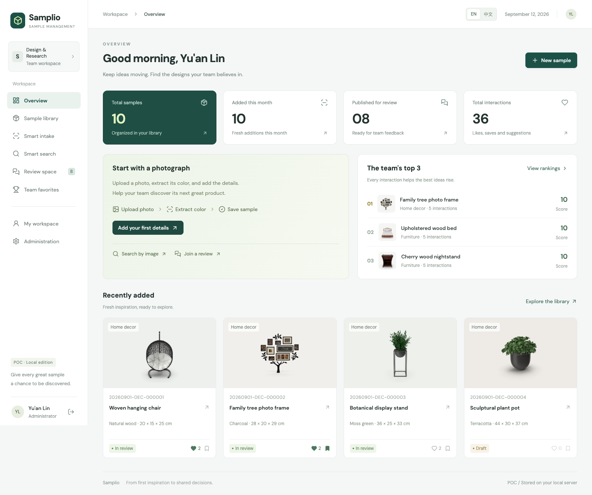
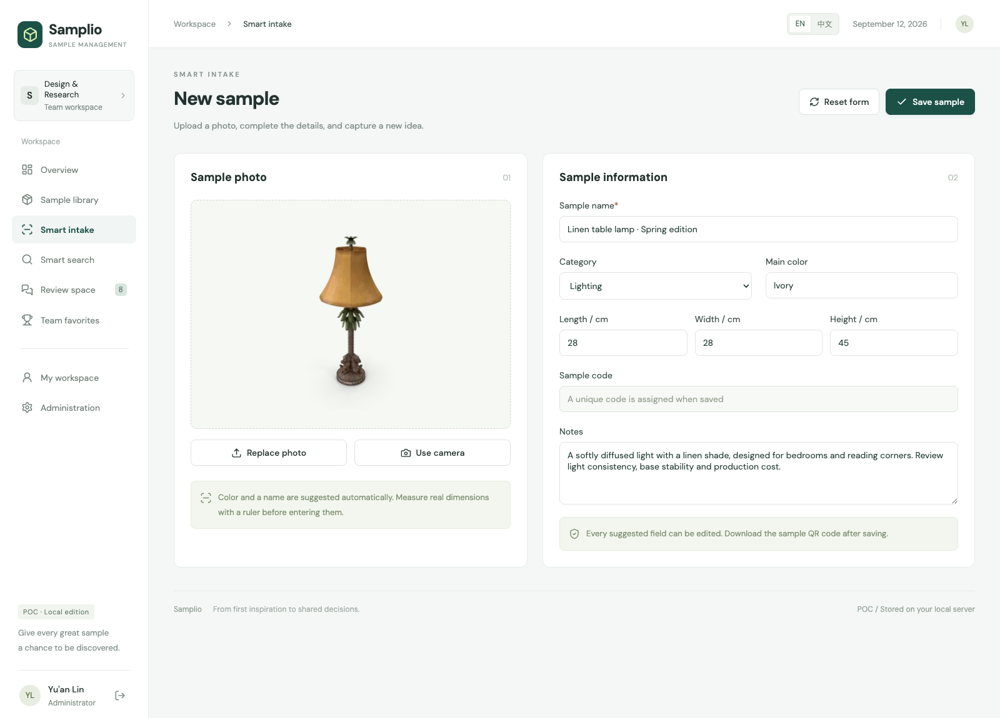
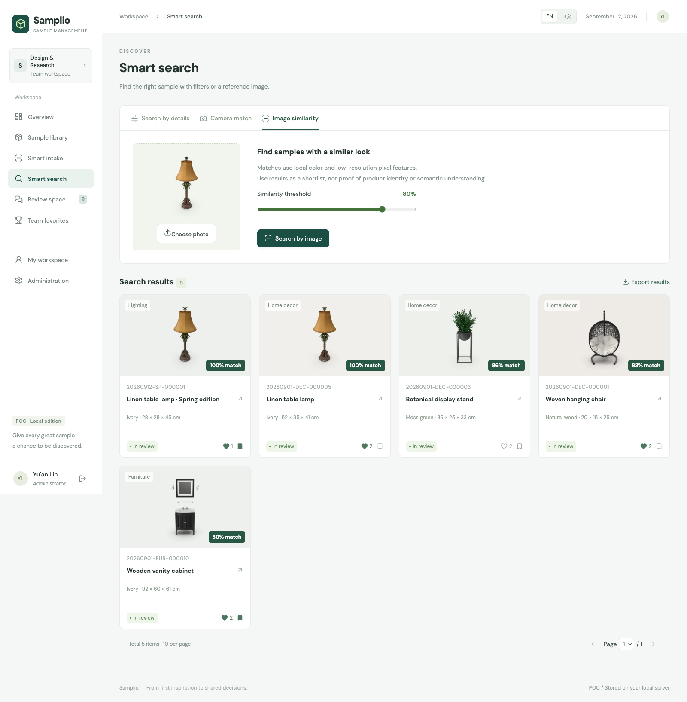
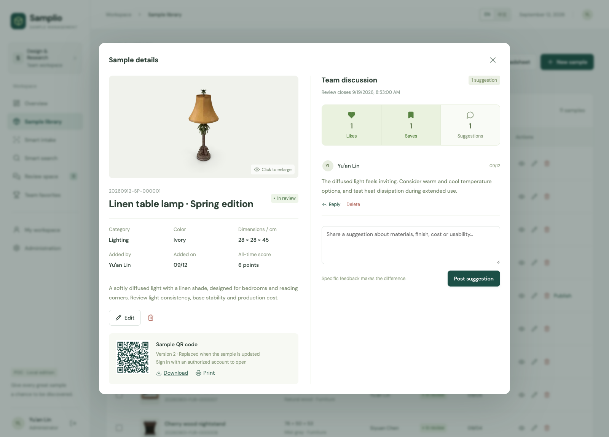
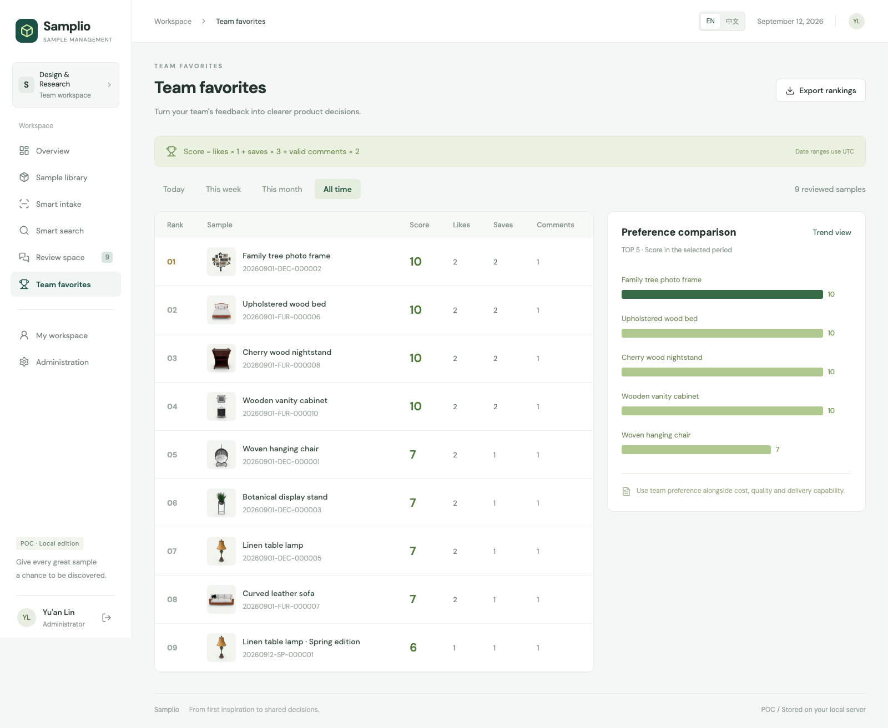
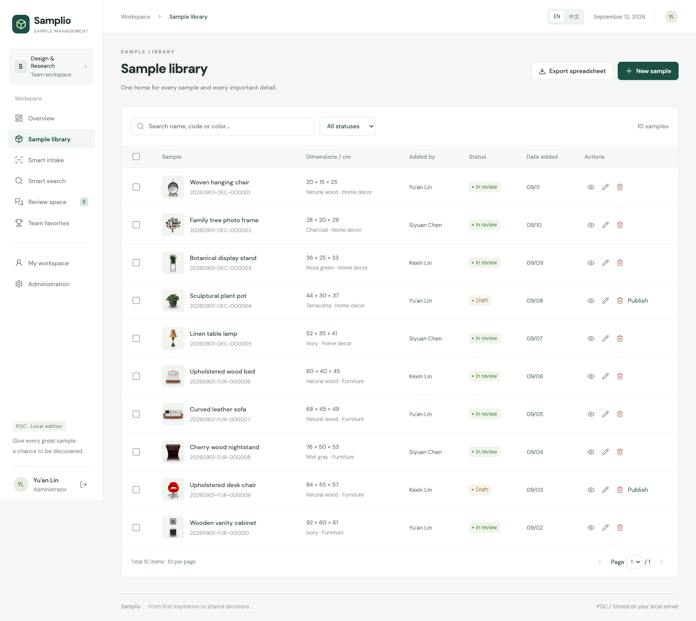
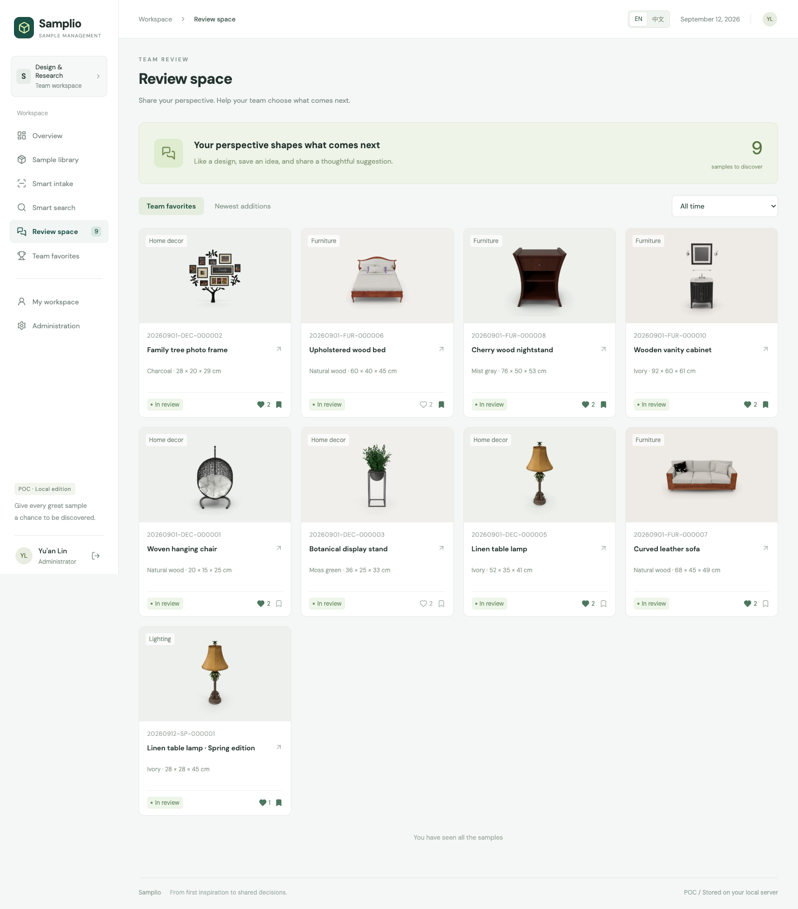
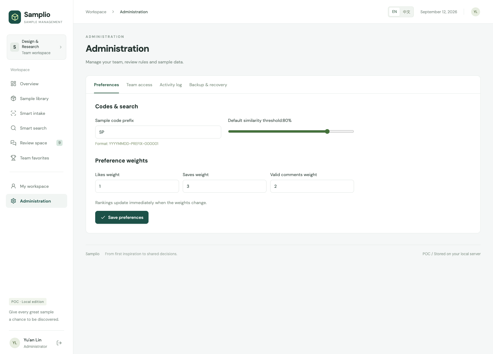
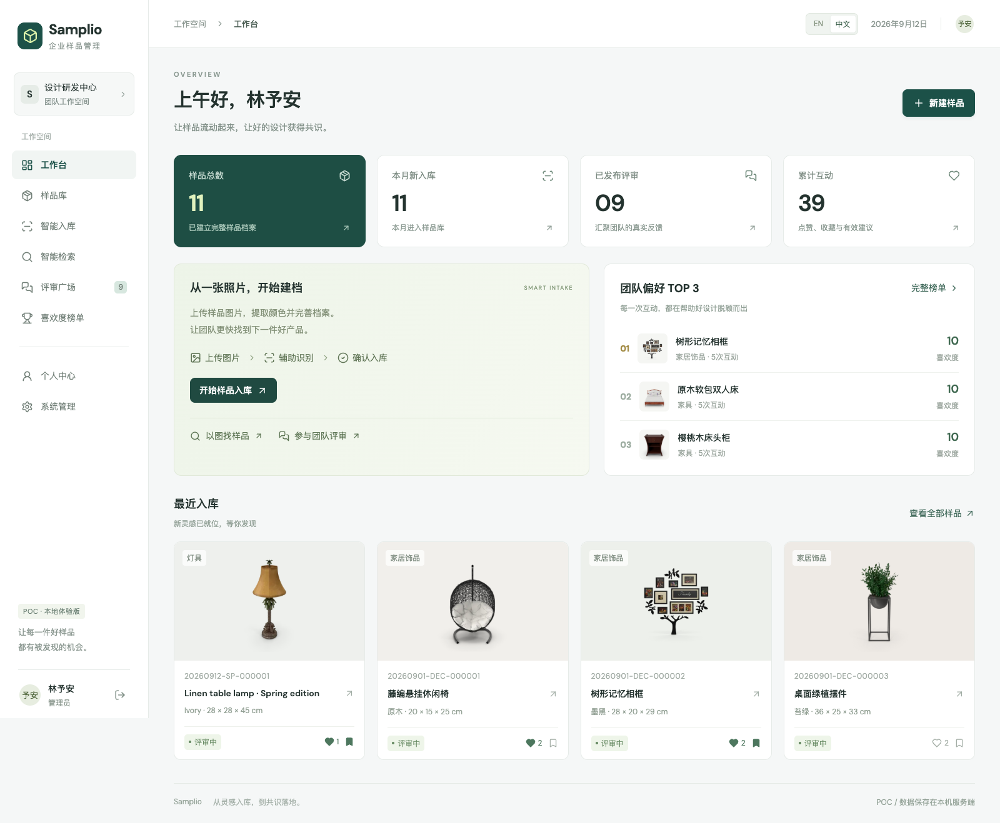
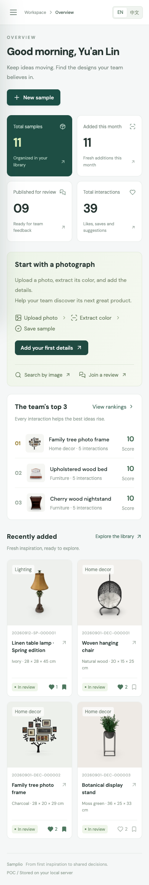

# Samplio

**From a sample photo to a shared product decision.**

An English-first, bilingual sample-management POC for product and design teams. Capture samples, find visual matches, collect feedback, and discover what your team wants to develop next.

[简体中文](README.zh-CN.md) · [Quick start](#quick-start) · [Requirements](docs/PRD.md) · [Feature scope](docs/SCOPE.md) · [API guide](docs/API.md)



## See the workflow

These are screenshots of the running application—not mockups. The repository includes the working frontend, backend, database initialization and demo images.

| Capture & organize | Discover & decide |
| --- | --- |
| **Smart intake** — upload or photograph a sample, extract its color, and complete its record.<br/><br/> | **Image search** — shortlist samples by visual similarity.<br/><br/> |
| **Team review** — publish a sample, like it, save it, and discuss improvements.<br/><br/> | **Team favorites** — compare weighted scores across different periods.<br/><br/> |

<details>
<summary>More screens: library, review space, administration, mobile and Chinese</summary>

### Sample library



### Review space



### Administration



### Chinese interface



### Mobile



</details>

## What works

- **English and Simplified Chinese:** English is the default. Switch at sign-in or in the top bar; the preference persists on your device. Built-in sample names and interface messages are localized. User-entered content is preserved as entered.
- **Real sign-in and roles:** server-side sessions, password hashing, administrator/member permissions and private draft visibility.
- **Persistent sample library:** SQLite records, local photo uploads, editable fields, unique generated codes, bulk soft deletion and admin recovery.
- **Photo-assisted intake:** camera capture or file upload, actual local color extraction, suggested names and manual measurements.
- **Visual discovery:** combined text/color/dimension/date filters, sorting, local search history and image similarity scores.
- **Versioned QR codes:** download or print a QR code for the sample. Editing, publishing, deleting or restoring invalidates older links. Opening a record still requires authorization.
- **Team reviews:** publish with a deadline; toggle a single like/save per person; add comments and replies; reject basic spam and duplicate comments.
- **Weighted rankings:** configurable weights (default: like 1, save 3, comment 2), today/week/month/all-time views, comparison bars and a seven-day comment-activity chart.
- **Excel exports:** download sample records or rankings, with scores matching the selected time period and localized column labels.
- **Admin tools:** team roles, score weights, code prefix, search threshold, read-only activity logs, recycle bin and business snapshot export/restore.

## Quick start

### Requirements

- **Node.js 22.13 or later** (Node.js 24 LTS recommended)
- npm
- A modern browser

No external AI key, cloud account or database setup is required.

```bash
# Or download and extract the repository ZIP.
git clone https://github.com/chatpoc-ai/samplio.git
cd samplio
npm ci
npm run build
npm start
```

Open **http://127.0.0.1:3001**.

On first start, the app creates `data/samplio.sqlite`, local upload storage and ten example samples. Records survive server restarts. Stop the process with `Ctrl+C`.

### Local demo accounts

Account details belong here, not on the sign-in screen. They are development fixtures, not credentials for a hosted service.

| Role | Username | Default password |
| --- | --- | --- |
| Administrator | `admin` | `Samplio2026!` |
| Team member | `chen` | `Samplio2026!` |
| Team member | `lin` | `Samplio2026!` |

To use a different initial password, copy `.env.example` to `.env`, set `DEMO_PASSWORD`, and then start the app **before its first database initialization**. Changing the variable later does not reset existing account passwords. `.env` and `data/` are excluded from Git.

### Development

```bash
npm run dev
```

Open **http://127.0.0.1:5173**. Vite forwards API and upload requests to the local backend on port 3001. The local preview origin is explicitly allowed during development. To change the backend port in development, update the Vite proxy as well.

### A five-minute tour

1. Sign in as `admin` and explore the overview and sample library.
2. Open **Smart intake**, upload an image, confirm the suggested color/name, and enter measured dimensions.
3. Save the sample, then publish it from the library with a review deadline.
4. Open its details to add a like, a save and a specific suggestion.
5. Explore **Smart search** and **Team favorites**, then export a spreadsheet.
6. Switch to `chen` to see the employee permissions, or change the interface to Chinese.

## Honest POC boundaries

This is a working prototype, **not a production enterprise system**.

- **No real-world dimensions from a photo.** A single image without calibration cannot reliably yield length, width and height. New dimensions are left empty for manual measurement; fixture dimensions are illustrative.
- **No vision LLM or semantic embedding service.** Color comes from a downsampled image. Similarity compares normalized RGB pixels; it is sensitive to background, lighting and rotation. “Camera match” uses a stricter threshold, not guaranteed product identity.
- **Local storage, not encrypted enterprise storage.** Photos and SQLite data live in `data/`. OS-level access can alter the database and logs. No scheduled backups, tamper-proof audit store, SSO, SMS recovery or 1,000-user performance guarantees are provided.
- **Periodic refresh, not real-time collaboration.** The UI refreshes shared records every 30 seconds. Review rankings count currently retained interactions in UTC periods; they are not an immutable historical event ledger.
- **Publication is owner/admin controlled.** A separate administrator approval queue is not implemented.
- **Snapshot restore is installation-local.** The JSON snapshot restores records and interactions, keeps accounts/preferences/logs, and requires the existing image files. Stop the server and copy the whole `data/` directory for a complete backup.
- The coding prototype is independent of the ChatPOC contributor API. No ChatPOC key is required, included or transmitted.

The detailed [scope matrix](docs/SCOPE.md) maps the request to working capabilities and follow-up work.

## Architecture

```text
Browser: React + Vite + bilingual interface
                │ same-origin JSON / multipart API
                ▼
Node.js + Express
  ├─ SQLite: samples, users, sessions, interactions, audit events
  ├─ Sharp: validated image decoding, resizing, color/pixel features
  ├─ QRCode: versioned sample links
  ├─ ExcelJS: formatted workbook exports
  └─ Local uploads: data/uploads/
```

```text
src/                 React interface, theme, English translation dictionary
server/              API, permissions, database schema, image features, demo seed
public/demo/         Example photos and their source manifest
scripts/             Browser acceptance checks and screenshot generation
tests/               Isolated API integration tests
docs/screenshots/    Real screenshots used in both READMEs
docs/                Scope, API reference and verification notes
```

The optional browser WebMCP integration registers read/search and open-detail tools only when the browser supports `document.modelContext`. These use the same authenticated API; they do not grant additional permissions. The ordinary HTTP API is documented in [docs/API.md](docs/API.md).

## Verification

```bash
npm test
npm run build

# Install the browser once, then run the complete UI tour.
npx playwright install chromium
npm run test:browser

# Alternative: use an already-installed Google Chrome.
PLAYWRIGHT_CHANNEL=chrome npm run test:browser
```

Tests use temporary databases and leave your workspace data unchanged. Browser checks regenerate the screenshots from their own demo workspace. See [verification notes](docs/VERIFICATION.md).

## Configuration

The startup scripts load `.env` when present. Supported variables:

| Variable | Default | Purpose |
| --- | --- | --- |
| `HOST` | `127.0.0.1` | Server bind address |
| `PORT` | `3001` | Backend / built-app port |
| `DATA_DIR` | `./data` | Database and upload directory |
| `DEMO_PASSWORD` | `Samplio2026!` | Initial fixture password, first initialization only |
| `COOKIE_SECURE` | `false` | Set `true` when served over HTTPS |
| `PUBLIC_ORIGIN` | unset | Exact allowed external origin behind a reverse proxy |
| `NODE_ENV` | unset | Set `production` to disable the development-origin allowance |
| `NO_SEED` | unset | Set `1` to omit sample fixtures; demo accounts are still initialized |

## Credits & license

Original application code is licensed under [MIT](LICENSE). Demo product thumbnails come from [DummyJSON](https://dummyjson.com/); exact source URLs are recorded in [public/demo/sources.json](public/demo/sources.json). Product images and marks remain subject to their respective owners' rights and are not relicensed by this repository's MIT license. Replace them with your own assets for commercial use. Icons are from Lucide (ISC).
