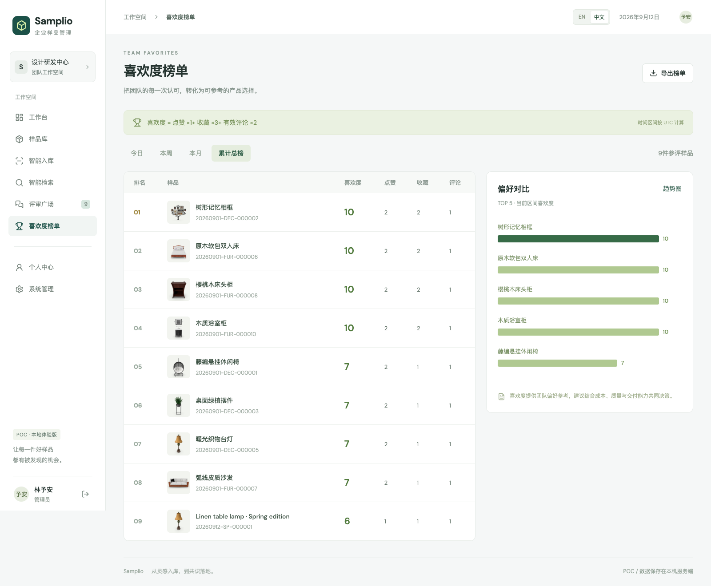

# Samplio 企业样品管理

**从一张样品照片，到团队共同的产品判断。**

面向产品与设计团队的中英文样品管理 POC：图片入库、样品检索、协同评审与喜欢度排名。默认英文，支持一键切换简体中文。

[English](README.md) · [快速开始](#快速开始) · [功能边界](docs/SCOPE.md) · [API 文档](docs/API.md)


## 看看实际功能

以下均为**运行中的应用截图**，不是静态设计稿。仓库包含前端、后端、数据库初始化与演示图片，下载即可本地体验。

| 入库与整理 | 检索与决策 |
| --- | --- |
| **样品入库**：上传或拍照、提取颜色、完善档案。<br/><br/> | **图片检索**：按基础视觉相似度寻找候选样品。<br/><br/> |
| **协同评审**：发布样品、点赞、收藏、评论与回复。<br/><br/> | **喜欢度榜单**：按时间范围比较加权得分。<br/><br/> |

<details>
<summary>更多截图：样品库、评审广场、管理后台、移动端</summary>


</details>

## 已实现

- **中英文界面**：默认英文，登录页和顶部导航均可切换；语言偏好保存在当前设备。系统文案与内置演示数据名称有翻译，用户录入的内容保留原文。
- **真实登录与权限**：服务端会话、密码哈希、管理员 / 员工角色；未发布样品仅本人和管理员可见。
- **持久化样品库**：SQLite 存储、图片上传、字段编辑、唯一自动编号、批量软删除、管理员恢复。
- **图片辅助入库**：摄像头或文件上传、实际颜色提取、名称建议；尺寸由用户实测填写。
- **多维检索**：名称、编号、颜色、长度、高度、日期组合查询，排序、本地搜索历史与图片相似度检索。
- **二维码版本控制**：支持下载与打印；修改、发布、删除、恢复后旧码失效，扫码仍需要登录并具有访问权限。
- **团队评审**：设置截止时间、单人单次点赞 / 收藏及取消、评论回复、基础重复与灌水过滤。
- **喜欢度排名**：默认点赞 1 分、收藏 3 分、有效评论 2 分；支持改权重、今日 / 本周 / 本月 / 累计筛选、柱状对比与近七天评论热度。
- **Excel 导出**：导出样品或榜单，榜单得分与所选时间范围一致，列标题随界面语言变化。
- **管理后台**：角色调整、编号前缀、相似度阈值、权重配置、只读日志、回收站、业务快照备份恢复。

## 快速开始

需要 **Node.js 22.13+**（建议 Node.js 24 LTS）、npm 和现代浏览器。不需要 AI key、云账号或额外安装数据库。

```bash
# 也可以从 GitHub 下载 ZIP 后解压。
git clone https://github.com/chatpoc-ai/samplio.git
cd samplio
npm ci
npm run build
npm start
```

打开 **http://127.0.0.1:3001**。

首次启动自动生成 `data/samplio.sqlite`、上传目录与 10 个演示样品。关闭服务后数据仍保留，下次启动继续使用。按 `Ctrl+C` 停止服务。

### 本地演示账号

账号说明放在文档中，不显示在网页登录页。这些是开发演示账号，不是某个线上服务的登录凭证。

| 角色 | 账号 | 默认密码 |
| --- | --- | --- |
| 管理员 | `admin` | `Samplio2026!` |
| 普通员工 | `chen` | `Samplio2026!` |
| 普通员工 | `lin` | `Samplio2026!` |

要自定义初始密码，**首次启动前**复制 `.env.example` 为 `.env` 并修改 `DEMO_PASSWORD`。数据库创建后再改环境变量不会重置现有密码。`.env` 和 `data/` 均不提交到 Git。

### 开发模式

```bash
npm run dev
```

打开 **http://127.0.0.1:5173**。Vite 将 API 与上传请求转发到本机 3001 端口，后端显式允许开发预览来源。修改开发模式后端端口时，也要同步修改 Vite 代理。

### 五分钟体验流程

1. 用 `admin` 登录，浏览工作台与样品库。
2. 进入「智能入库」，上传图片、确认颜色与名称、填写实测尺寸。
3. 保存后，在样品库发布评审并设置截止时间。
4. 打开详情，点赞、收藏并提交具体建议。
5. 尝试图片检索、榜单时间筛选和 Excel 导出。
6. 切换 `chen` 体验员工权限，或在右上角切换语言。

## POC 的实际边界

这是可运行原型，**不等于已完成生产级企业系统**。

- **没有从照片推断真实长宽高**：缺少标尺或标定的单张图片无法可靠测量真实尺寸。新档案留空供人工填写，演示数据中的尺寸仅用于展示。
- **没有接入视觉大模型 / 语义向量检索**：颜色来自图片降采样；相似度基于归一化 RGB 像素，受背景、光照和旋转影响。「拍照比对」使用更严格阈值，不保证识别同款。
- **本地存储尚未加密**：图片和 SQLite 文件保存在 `data/`。具有操作系统权限的人仍可修改数据库与日志。未实现每日自动备份、不可篡改审计、SSO、短信找回和千人并发保障。
- **定时刷新而非实时推送**：界面每 30 秒刷新共享数据。榜单按 UTC 时间范围统计当前仍保留的互动，不是不可变历史事件账本。
- **发布由本人 / 管理员操作**：尚未实现独立的管理员发布审批队列。
- **快照只适合同一安装实例恢复**：JSON 恢复档案和互动；保留账号、配置与日志，需要原图片文件仍存在。完整备份需停服后复制整个 `data/` 目录。
- 本项目独立于 ChatPOC 贡献者 API，未包含、使用或上传任何 ChatPOC key。

更完整的需求对照见 [功能范围文档](docs/SCOPE.md)。

## 技术结构

- React + Vite：界面与开发服务
- Node.js + Express：API、会话与权限
- Node 内置 SQLite：样品、账号、互动、日志
- Sharp：图片验证、压缩、颜色与像素特征
- QRCode：版本化二维码
- ExcelJS：Excel 工作簿导出

```text
src/                 界面、样式、英文翻译字典
server/              API、数据库、权限、图片处理、演示初始化
public/demo/         演示图片及来源清单
scripts/             浏览器验收与截图脚本
tests/               独立数据库 API 集成测试
docs/screenshots/    README 中使用的真实截图
docs/                功能范围、API 与验收说明
```

支持 WebMCP 的浏览器可发现「搜索样品」「打开样品详情」工具；使用相同权限校验，不额外放宽访问范围。普通 HTTP API 见 [API 文档](docs/API.md)。

## 验证与重新截图

```bash
npm test
npm run build
npx playwright install chromium
npm run test:browser

# 或使用已安装的 Google Chrome：
PLAYWRIGHT_CHANNEL=chrome npm run test:browser
```

测试使用临时数据库，不影响本机正在使用的工作空间；浏览器脚本会重新生成截图。详见 [验收说明](docs/VERIFICATION.md)。

启动配置支持 `HOST`、`PORT`、`DATA_DIR`、`DEMO_PASSWORD`、`COOKIE_SECURE`、`PUBLIC_ORIGIN`、`NODE_ENV` 与 `NO_SEED`。含义与默认值见英文 README 的 [Configuration](README.md#configuration)；启动脚本会读取存在的 `.env`。

## 授权与素材

原创代码使用 [MIT License](LICENSE)。演示商品缩略图来自 [DummyJSON](https://dummyjson.com/)，原始链接见 [素材清单](public/demo/sources.json)。图片及品牌权利归原权利人，不包含在本仓库 MIT 授权范围内；商业使用时请替换为自己的素材。图标来自 Lucide（ISC）。
